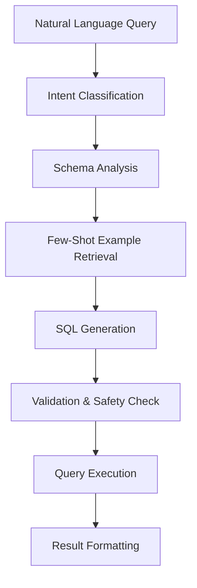

# SQL Chat

Query your databases using natural language - no SQL knowledge required.

---

## Overview

SQL Chat lets you connect to databases and ask questions in plain English. The AI translates your questions into SQL, executes them safely, and presents results in a readable format.

**Supported Databases:**

- PostgreSQL
- MySQL
- SQLite

---

## Getting Started

### 1. Add a Database Connection

1. Go to **SQL Chat** in the navigation
2. Click **"Add Connection"**
3. Fill in connection details:

| Field | Description | Example |
|-------|-------------|---------|
| Name | Friendly name | "Production Analytics" |
| Type | Database type | PostgreSQL |
| Host | Server address | localhost |
| Port | Server port | 5432 |
| Database | Database name | analytics_db |
| Username | DB user | readonly_user |
| Password | DB password | ••••••••• |

4. Click **"Test Connection"** to verify
5. Click **"Save"**

!!! warning "Security"
    Always use a **read-only database user**. SQL Chat enforces read-only queries, but using a read-only user provides defense in depth.

### 2. Start Querying

Once connected, start asking questions:

```
You: How many orders were placed last month?
AI: There were 1,247 orders placed in December 2024.

    | month      | order_count |
    |------------|-------------|
    | 2024-12    | 1,247       |
```

---

## Query Examples

### Basic Lookups

```
"Show me all customers from California"
"What are the top 10 products by revenue?"
"List employees hired in 2024"
```

### Aggregations

```
"What's the total revenue by region?"
"Average order value per customer segment"
"Count of active users by month"
```

### Comparisons

```
"Compare sales Q3 vs Q4 2024"
"Which products grew more than 20% year-over-year?"
"Show me underperforming regions"
```

### Time-based Analysis

```
"Revenue trend for the last 12 months"
"Daily active users this week"
"Orders by hour of day"
```

---

## How It Works

### Query Pipeline



### Intent Classification

The system classifies your query intent:

| Intent | Example | Behavior |
|--------|---------|----------|
| Lookup | "Show me customer X" | Simple SELECT |
| Aggregation | "Total sales by region" | GROUP BY queries |
| Comparison | "Compare A vs B" | Multiple aggregations |
| Trend | "Sales over time" | Time-series analysis |
| Filter | "Orders above $1000" | WHERE clauses |

### Few-Shot Learning

SQL Chat uses a RAG-based few-shot retriever trained on 100,000+ SQL examples (Gretel dataset). For each query, it retrieves similar examples to guide SQL generation.

### Schema Understanding

The system introspects your database schema:

- Table names and relationships
- Column names and types
- Foreign key constraints
- Sample values (for categorical columns)

This context helps generate accurate queries.

---

## Safety Features

### Read-Only Enforcement

SQL Chat blocks all data-modifying operations:

- ❌ INSERT, UPDATE, DELETE
- ❌ DROP, TRUNCATE, ALTER
- ❌ CREATE, GRANT, REVOKE
- ✅ SELECT only

### Query Validation

Before execution, queries are validated for:

- SQL injection patterns
- Forbidden operations
- Cost estimation (prevents expensive queries)

### Data Masking

Sensitive data can be automatically masked:

| Pattern | Action | Example |
|---------|--------|---------|
| Email | Mask | j***@example.com |
| Phone | Mask | ***-***-1234 |
| SSN | Redact | [REDACTED] |
| Password | Redact | [REDACTED] |

Configure in `config/dbnotebook.yaml` (under `sql_chat:` section) or environment variables.

---

## Conversation Context

SQL Chat maintains conversation history:

```
You: Show me the top 5 customers
AI: [Shows top 5 customers by revenue]

You: What products did they buy?
AI: [Correctly interprets "they" as the top 5 customers from previous query]
```

### Session Memory

- Query history preserved per session
- Context carries forward for follow-ups
- "Compare that to..." references previous results

---

## Schema Dictionary

For better results, SQL Chat can create a schema dictionary - a notebook containing your database schema that enables RAG-enhanced query understanding.

### Generate Schema Dictionary

1. Click **"Generate Schema Dictionary"** on your connection
2. A new notebook is created with:
   - Table descriptions
   - Column definitions
   - Relationship documentation
   - Sample queries

### Benefits

- Better query understanding
- More accurate SQL generation
- Handles domain-specific terminology

---

## Configuration

### Environment Variables

```bash
# Encryption key for stored credentials
SQL_CHAT_ENCRYPTION_KEY=your-fernet-key-here

# Skip read-only check (dev only!)
SQL_CHAT_SKIP_READONLY_CHECK=false

# Few-shot examples
FEW_SHOT_MAX_EXAMPLES=100000

# Reranker for SQL (separate from RAG)
SQL_RERANKER_MODEL=large
```

### Connection Limits

```yaml
# config/dbnotebook.yaml (sql_chat section)
sql_chat:
  connections:
    max_per_user: 10
    pool:
      size: 5
      timeout_seconds: 30

  query:
    max_rows: 10000
    timeout_seconds: 30
    max_correction_attempts: 3
```

---

## API Usage

### List Connections

```bash
curl http://localhost:7860/api/sql-chat/connections \
  -H "X-API-Key: YOUR_KEY"
```

### Execute Query

```bash
curl -X POST http://localhost:7860/api/sql-chat/query/{session_id} \
  -H "Content-Type: application/json" \
  -H "X-API-Key: YOUR_KEY" \
  -d '{
    "query": "What are the top 10 products by revenue?"
  }'
```

### Streaming Query

```bash
curl -X POST http://localhost:7860/api/sql-chat/query/{session_id}/stream \
  -H "Content-Type: application/json" \
  -H "X-API-Key: YOUR_KEY" \
  -d '{
    "query": "Analyze sales trends"
  }'
```

---

## Troubleshooting

### "Connection failed"

- Verify host, port, database name
- Check username/password
- Ensure database allows remote connections
- Check firewall rules

### "Query timeout"

- Query may be too expensive
- Add LIMIT to reduce results
- Check database performance
- Increase `query.timeout_seconds`

### Incorrect SQL generated

- Be more specific in your question
- Reference exact table/column names
- Generate a schema dictionary for better context
- Check that the schema is being detected correctly

### "Access denied" on query

- Ensure database user has SELECT permissions
- Check table-level permissions
- Verify schema access

See [Troubleshooting Guide](../troubleshooting.md) for more solutions.
